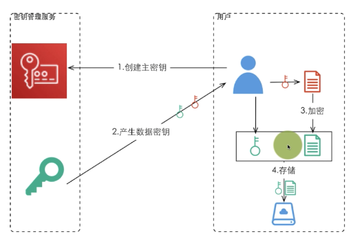
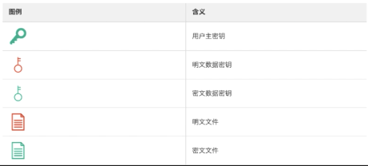

# | Organizational Complexity 

## || 多账户策略

### 身份账户 +实践

> Identity Account Architecture

- 在单一的中央区域对所有用户进行**集中管理**；并允许他们访问多个 AWS 账户下的不同 AWS 资源。
- 可以通过**跨账户 IAM 角色** 和 **身份联合**（Federation）来完成。


**实践**

**背景**

- AS-IS：假设有 4 个 aws 账户，就需要为新员工创建 4 个 IAM 用户、管理不便；
- TO-BE：只需将新员工加入身份账户；

**思路**

- 设置独立专用的 `身份账户 Identity Account`，集中建立用户、密码、访问秘钥、管理用户。

  > 建议身份账户只用于用户管理，不做资源管理

- 在身份账户与企业其他账户直接**建立信任关系**，在其他账户中建立**角色**，将身份账户设置为受信任实体，并设置**策略**。

- 用户登录身份账户后，通过**切换角色**，即可访问不同账户的资源。

**步骤**

- 在身份账户中创建一个 **IAM 用户** zhangsan；
  - IAM --> 用户 --> 添加用户 
- 在生成环境账户中创建一个 **跨账户角色** CA-TEST，并分配S3完全访问权限；
  - IAM --> 角色 --> 创建角色 
  - 选择受信任实体类型 = 其他AWS账户 --> 输入 zhangsan id
  - 选择权限策略 --> S3 完全访问
  - 摘要：拷贝出切换链接
- 在身份账户中配置允许 zhangsan 切换到生成环境账户的 CA-TEST角色；
  - IAM --> 用户 --> 添加内联策略
- 切换角色：输入地址
  - 登录zhangsan --> 执行切换链接 --> 即可切换到生产环境账户 --> 测试 S3 完全访问
  - 后续切换：右上角 --> 角色历史记录


### 日志账户

> Logging Account Architecture

- 将所有账户的所需日志**集中存储**在一个中心区域；


### 发布账户

> Publishing Account Structure

- **集中管理**整个企业预先批准的 AMI、aws CloudFormation 模板。


### 账单结构

> Billing Structure

- 建立主账户，**整合支付**所有成员子账户。
- 统一支付、账单追踪、合并使用量


## || AWS Organizations

目的：将多个 AWS 账户（成员账户）整合到集中管理的组织（主账户）中，进行账户管理、整合账单。

- 我的账户 - 账单

### 服务控制策略 +实践

> SCP: Service Control Policy


**实践**

主账户

- AWS organizations --> 创建 --> 选择仅整合账单，或所有功能 --> 当前账户会成为主账户。
- 添加账户 --> 邀请现有账户，或创建新账户

成员账户

- AWS organizations --> 打开并接受新邀请；
- 我的账单 --> 确认账户已成为组织成员；

配置策略

- 主账户 --> AWS organizations --> 策略 - 服务控制策略 --> 创建策略 （例如禁止访问S3）
- 主账户 --> AWS organizations --> 账户 --> 选中成员账户 --> 附加 策略


## || 日志


### 集中式日志存储架构 +实践

如何查看服务器日志？

- 方法一：给开发人员分配 ssh 权限；
- 方法二：集中式日志存储架构，将所有账户的所需日志集中存储在一个中心区域，集中进行监控分析。


最佳实践：

- 尽早定义日志保留实践、生命周期（冷数据存 Glacier）
- 生命周期策略自动化
- 自动安装和配置日志agent（处理 autoscaling）
- 支持混合云架构


AWS 提供的集中式日志解决方案：

- AWS ElasticSearch Service
- AWS CloudWatch Logs
- Kinesis Firehose
- AWS S3


**实践**

将各个**账户**的日志 发送到**中央账户** S3 存储桶。


- 中央账户：创建 S3 存储桶；并配置策略：权限 --> 存储桶策略。

  ```json
  {
      "Version": "2012-10-17",
      "Statement": [
          {
              "Sid": "AWSCloudTrailAclCheck20150319",
              "Effect": "Allow",
              "Principal": {
                  "Service": "cloudtrail.amazonaws.com"
              }, //or config.amazonaws.com
              "Action": "s3:GetBucketAcl",
              "Resource": "arn:aws:s3:::iloveawscn-central-config"
          },
          {
              "Sid": "AWSCloudTrailWrite20150319",
              "Effect": "Allow",
              "Principal": {
                  "Service": "cloudtrail.amazonaws.com"
              },
              "Action": "s3:PutObject",
              "Resource": "arn:aws:s3:::iloveawscn-central-config/*",
              "Condition": {
                  "StringEquals": {
                      "s3:x-amz-acl": "bucket-owner-full-control"
                  }
              }
          }
      ]
  }
  ```

  

- CloudTrail  转发配置

  - 账户B : CloudTrail --> 创建跟踪 --> 存储位置：S3 存储桶

- Config 日志转发配置
  
  - 账户B: aws config --> 设置：S3 存储桶

> Q: CloudTrail / Config 日志分别是什么时候生成？


### CloudWatch Logs +实践

在ec2上按照 CloudWatch Logs代理，将相关日志推动到 **CloudWatch 日志组**。接下来即可在cloudwatch日志组中检索日志。

**实践**

把 Linux 系统日志内容推送到 中央CloudWatch

- 为 EC2 分配 **IAM 角色**，以便允许 EC2 创建日志组、发送到日志组；

  - IAM --> 角色 - 创建角色 --> 选择EC2 --> 附加策略：CloudWatchAgentServerPolicy
  - EC2 --> 实例 --> 设置 - 附加/替换 IAM 角色 --> 选择上一步的角色；

- 在 EC2 上安装并配置 **CloudWatch Logs代理**；

  - 安装：`yum install -y awslogs`

  - 配置：

    ```sh
    $ cd /etc/awslogs
    # 两个配置文件 awscli.conf, awslogs.conf
    
    $ vi awscli.conf
    [plugins]
    cwlogs = cwlogs
    [default]
    region = us #根据实际配置region
    
    $ vi awslogs.conf
    ...
    [/var/logs/messages] #对应会创建日志组
    file = /var/logs/messages
    ```

- 启动 CloudWatch Logs代理；

  - `systemctl start awslogsd`
  - 代理本身的日志文件：/var/log/awslogs.log

- 验证：CloudWatch --> 日志组 --> /var/logs/messages


## || 权限策略


### S3 存储桶策略

S3 访问策略

- 基于资源
  - ACL 访问控制列表
  - 存储桶策略
- 基于用户

实践

- 配置允许所有人访问：

  - S3 --> 权限 --> unselect “阻止全部公共访问权限”；选择文件 --> 公开

- 允许特定IP 段的存储桶策略：

  - S3 --> 权限 --> 存储桶策略

    ```json
    {
       "Version":"2012-10-17",
       "Id":"S3PolicyId1",
       "Statement":[
          {
             "Sid":"statement1",
             "Effect":"Deny",
             "Principal":"*",
             "Action":[
                "s3:*"
             ],
             "Resource":"arn:aws:s3:::examplebucket/*",
             "Condition":{
                "NotIpAddress":{ //除这个ip之外的 都deny
                   "aws:SourceIp":"192.168.143.188/32"
                }
             }
          }
       ]
    }
    ```


### 跨账户 S3 存储桶访问

将 S3 访问权限授予不同的 aws 账户。

- 访问目的：Account A 

  - S3 --> 权限 --> 存储桶策略

  ```json
  {
      "Version": "2012-10-17",
      "Statement": [
          {
              "Sid": "cross",
              "Effect": "Allow",
              "Principal": {
                  "AWS": "arn:aws:iam::256454142732:root"
              },
              "Action": "s3:*",
              "Resource": [
                  "arn:aws:s3:::iloveawscn", //当前存储桶的ARN
                  "arn:aws:s3:::iloveawscn/*"
              ]
          }
      ]
  }
  ```

- 访问来源：Account B

  - IAM --> 用户 --> 访问秘钥

  - 将 A 和 B 的凭证配置到 CLI Credentials 配置文件

    - cat .aws/credentials

      ```properties
      [accounta]
      aws_access_key_id = 
      aws_secret_access_key = 
      
      [accountb]
      aws_access_key_id = 
      aws_secret_access_key = 
      ```

  - 访问：`aws s3 ls s3://iloveaswcn/ --profile accountb` 

  - 上传：`aws s3 cp accountb_file s3://iloveawscn/ --profile accountb`

  - Q: 用 accounta 下载 accountb_file 会报403，为什么？

    - ACL ! 

### S3 标准 ACL

基础知识

- ACL 作为子资源附加到 存储桶或对象上；新对象默认会分配“资源拥有者完全访问权限”。
- `get-object-acl` 查看附加的ACL具体内容；
  `aws s3api get-object-acl --bucket iloveawscn --key accountb_file --profile accountb`


标准 ACL：一系列预定义的授权

- 创建时，通过 `x-amz-acl` 请求头指定；
  `aws s3 cp acl.txt s3://iloveawscn/ --acl bucket-owner-full-control --profile accountb`

- 标准 ACL 列表：

  | ACL                       | 适用         | 所有者       | 其他                                           |
  | ------------------------- | ------------ | ------------ | ---------------------------------------------- |
  | private                   | bucket / obj | FULL_CONTROL | 其他人无权限                                   |
  | public-read               | bucket / obj | FULL_CONTROL | READ                                           |
  | public-read-write         | bucket / obj | FULL_CONTROL | READ, WRITE                                    |
  | aws-exec-read             | bucket / obj | FULL_CONTROL | ec2 从 s3 获取对GET AMI 捆绑的read访问权限 (?) |
  | authenticated-read        | bucket / obj | FULL_CONTROL | AuthenticatedUsers组有READ权限                 |
  | bucket-owner-read         | obj          | FULL_CONTROL | 存储桶拥有者可以READ                           |
  | bucket-owner-full-control | obj          | FULL_CONTROL | 存储桶拥有者 FULL_CONTROL                      |
  | log-delivery-write        | bucket       |              | LogDelivery 组可以对桶 WRITE / READ_ACP        |

  


# | Design for New Solutions

## || 安全

### IAM: Identity and Access Management.

IAM vs. Policy 

- IAM 角色可附加多个策略。


原则

- 最小权限原则 Principle of Least Privilage


#### **IAM 策略评估模型**

> IAM Policy Evaluation Logic


- **Deny Evaluation**：是否有显示拒绝策略？-
  - 隐式拒绝。
- **Organizations SCPs**：组织是否有可应用的 SCP?
- **Resource-based Policies**：被请求的资源是否有policy?
- **IAM Permissions Boundaries**：当前 principal 是否有 permission boundary?
- **Session Policies**：当前 principal 是否是使用 policy 的session?
- **Identity-based Policies**：当前 principal 是否有基于identity的策略？


#### 实践：S3 IAM 策略

**实践1**：新增S3策略

- IAM --> 用户 --> 添加权限 --> AmazonS3ReadOnlyAccess
  - s3:Get, s3:List


**实践2**：有 N 个存储桶，只拒绝第 5 个

- 允许访问所有：IAM --> 用户 --> 添加权限 --> AmazonS3FullAccess

- 拒绝第5个：IAM --> 用户 --> 添加权限 --> 创建策略（策略编辑器）

  - 服务 --> 选择 S3

  - 操作 --> 选择所有；选择切换以拒绝权限

  - 资源 --> 添加 ARN --> 输入存储桶名称

  - 编辑策略 --> 删除部分自动生成的内容 (???)

    ```json
    {
      "Statement": [
        {
          "Sid": "VisualEditor1",
          "Effect": "Deny",
          "Action": "s3:*",
          "Resource": "arn:aws:s3:::iloveawscn5"
        }
      ]
    }
    ```

  - 附加策略到用户：

> 说明 显式拒绝策略的优先级高于允许策略。


**实践：通过附加 IAM 角色访问 S3**

- IAM 角色 --> 附加策略：S3ReadyOnly
- EC2 --> 设置IMA 角色 


### STS: Securtiy Token Service

通过 metadata 检索 IAM 角色临时安全凭证：`curl http://169.254.169.254/latest/meta-data/iam/security-credentials/S3ReadOnly/`

将返回：

- AccessKeyId: 
- SecretAccessKey:
- Token:
- Expiration: 

Token 并不是IAM角色生成，而是 STS 生成的。IAM 角色与 STS 服务会建立信任管理，通过STS 获取这些凭证。


什么是临时安全凭证？

- STS 创建可控制你的 aws 资源的临时安全凭证，将凭证提供给**受信任用户**。
- 临时安全凭证是短期的，有效时间几分钟或几小时。-- 无需显式撤销、轮换。
- 应用程序无需分配长期 AWS 安全凭证。


#### 实践：本地开发临时凭证

**实践1：信任管理配置**

- IAM --> 角色 - 选择角色 --> 信任关系  

  ```json
  //允许EC2代入该角色，调用 sts:AssumeRole 获取临时安全凭证
  {
    "Version": "",
    "Statement": [
      {
        "Effect": "Allow",
        "Principal": {
          "Service": "ec2.amazonaws.com"
        },
        "Action": "sts:AssumeRole" //?
      }
    ]
  }
  ```


AssumeRole: https://docs.aws.amazon.com/cli/latest/reference/sts/assume-role.html


**实践2：本地开发模拟 EC2 IAM 角色同样的权限**

- Local --> 编辑 credentials 文件 `vim ~/.aws/credentials`

  ```properties
  [accounta]
  ...
  
  [accountb]
  ...
  
  [ec2role]
  aws_access_key_id = 
  aws_secret_access_key = 
  aws_session_token = //来源自通过 metadata 检索 IAM 角色临时安全凭证：`curl http://169.254.169.254/latest/meta-data/iam/security-credentials/S3ReadOnly/`
  ```

- 通过临时凭证访问S3：`aws s3 ls --profile ec2role`


**实践3：本地开发使用STS生成临时凭证** (推荐)

是对实践2的优化。


只配置本地安全凭证：IAM --> 用户: zhangsan --> 安全证书：访问秘钥 --> 拷贝到 `.aws/credentials` 文件；

--> 并不能访问 S3. 


步骤：

- 在 IAM 中建立一个跨账户**角色** stroll；

  - IAM --> 角色 --> 创建 --> 选择受信任实体：其他 AWS 账户 - 输入zhangsan账户ID 

    ```json
    {
      "Statement": [
        "Principal": {
          //受信任实体：aws账户
          //区别于受信任实体EC2: "Service": "ec2.amazonaws.com"
          "AWS": "arn:aws:iam::12345:root"
        },
        "Action": "sts:AssumeRole"
      ]
    }
    ```

    

  - 附加一个 S3ReadOnly **权限策略**到 IAM 角色：IAM --> 角色 --> 附加权限策略 --> S3ReadOnly
    

- 给用户添加 **AssumeRole策略**：允许 IAM 用户（开发人员）STS Assume Role 权限，以便获得临时凭证访问 S3；

  - IAM --> 用户：zhangsan --> 添加内联策略
    - 服务 -->选择 STS
    - 操作 --> AssumeRole
    - 资源 --> 添加 ARN --> 拷贝stroll角色的 ARN （指定允许zhangsan承担的角色的ARN）
      

- 本地测试：
  - 获取临时安全凭证：`aws sts assume-role --role-arn arn:aws:iam::256454142732:role/stroll --role-session-name stroll`
  - 写入本地文件: `vi ~/.aws/credentials`
  - 测试访问：`aws s3 ls --profile zhangsansts`


**实践4：自动化获取临时凭证**

实践3可优化：aws sts assume-role --> 拷贝设置 credentials

思路：为AWS CLI 指定承担的角色。这样CLI 就会自动进行 AssumeRole调用。

> 类似 EC2 自动获取临时凭证，也是因为EC2上附加了 IAM 角色。


步骤：

- 设置 credentials：`vi ~/.aws/credentials`

  ```properties
  [default]
  aws_access_key_id = xx
  aws_secret_access_key = xx
  
  [automate]
  role_arn = arn:aws:iam::12345:role/stroll #角色
  source_profile = default #用户访问秘钥所在的profile
  ```

- 测试： `aws s3 ls --profile automate` 即可访问成功。


### KMS: Key Management Service

用于加密密钥的生成、管理、审计。

特点：

- 完全托管
- 集中式密钥管理
- 管理AWS服务的加密
- 成本低廉


#### **实践：主密钥加密解密**

- 创建**客户主密钥 CMK**

  - KMS --> 客户管理的密钥 --> 创建密钥 
    - 密钥类型：对称√、非对称
    - 密钥材料来源：KMS√、外部、自定义密钥库 CloudHSM
  - 定义密钥管理权限：密钥管理员 --> 选择 IAM 用户或角色
  - 定义密钥使用权限：
    

- 定义密钥管理员及**密钥用户**

  - 创建 IAM 用户：IAM --> 用户 --> 创建；
  - KMS --> 添加密钥用户 --> 获得 `访问密钥ID`、`私有访问密钥`
    

- 密钥用户使用`访问密钥ID`、`私有访问密钥` 来加密和解密数据

  > 注意：密钥不允许导出、只可在当前区域使用

  - 配置 CLI：`aws configure` --> 输入访问密钥、私有访问密钥、Region （IAM --> 用户 --> 安全证书 --> 创建访问密钥）
  - 为用户添加权限：IAM --> 用户 --> 添加内联策略 -- 否则aws kms list-keys 会拒绝访问
    - 服务 --> KMS
    - 操作 --> listkeys
  - 测试获取CMK： `aws kms list-keys` 列出当前账户所有 CMK

  

- 加密：`aws kms encrypt --key-id {密钥ID} --plaintext {待加密内容} --query CiphertextBlob --output text`

  - --query CiphertextBlob: 只返回密文，不返回密钥ID、算法；
  - --output text：去掉密文两边的引号；
  - 解码后输出到二进制文件：`| base64 --decode > encryptfile`
    

- 解密：`aws kms decrypt --ciphertext-blob fileb://encryptfile --query Plaintext --output text | base64 --decode`

  - --query Plaintext：只返回解密后文本，不返回密钥ID、算法；
  - 解码：`| base64 --decode`

  

> 加密解密过程中，主密钥一直存储在 KMS 中 由aws进行保存；用户通过密钥ID来进行加密，保障了主密钥的安全性。


#### KMS 信封加密

将加密数据的数据密钥封入信封中进行存储、传输，使用离线的密钥在本地加解密，**不再使用主密钥直接加解密数据**。

使用场景：

- 当加密数据较大时。- KMS 最大支持4KB
- 性能要求高时。- 因为降低了网络负载
- 传输过程中的安全风险。 - 窃听、钓鱼


**信封加密工作流程：**

1. 创建客户主密钥 CMK；
2. 调用 KMS generate-data-key 生成数据密钥（共两个，一个明文数据密钥，一个密文数据密钥）；
   - 实践 - 生成数据密钥：`aws kms generate-data-key --key-id {CMK密钥ID} --key-spec AES_256`
     - 密钥ID: 拷贝自 KMS --> 客户管理的密钥
     - --key-spec: 密钥长度
     - 返回值：Plaintext == 明文数据密钥，CiphertextBlob == 密文数据密钥；
3. 使用`明文数据密钥`加密文件；
4. 将加密后的文件、`密文数据密钥`一同存储；并删除明文文件、明文数据密钥。






**信封解密工作流程：**

1. 读取密文数据密钥、密文文件；
2. 调用 KMS decrypt，解密`密文数据密钥`，得到`明文数据密钥`；
3. 使用`明文数据密钥`解密文件；


### Network ACLs

**概念**

- 网络ACL是无状态的；

- 网络ACL 运行于子网级别，而安全组运行于实例级别；

  > 网络ACL规则控制允许进入子网的数据流，而安全组规则控制允许进入实例的数据流。

- VPC 中每一个子网都必须与网络ACL关联；-- 网络ACL : 子网 == 1 : N
- 默认网络ACL 允许所有入站和出站的流量；自定义网路ACL默认拒绝所有入站和出站流量，直到添加规则；


**网络ACL vs. 安全组**

|             | 安全组                           | 网络ACL                                |
| ----------- | -------------------------------- | -------------------------------------- |
| 运行级别    | 实例级别                         | 子网级别                               |
| 规则        | 仅支持允许规则                   | 支持允许规则、*拒绝规则*               |
| 状态        | 有状态，返回的数据流会被自动允许 | 无状态，返回的数据流必须被规则明确允许 |
| 规则判断(?) | 评估所有规则                     | 按照规则数字顺序，找到符合的规则即返回 |
| 应用时机    | 只有与实例关联时 才会应用规则    | 自动应用与之关联的子网下所有实例       |


**实战**：禁止特定 IP 访问 EC2 端口22

- EC2 --> 安全组 --> 入站规则：允许22端口，无法配置拒绝规则；
- VPC --> 网络ACL --> 选择默认ACL --> 确认关联子网 --> 默认入站规则 100 - 允许所有；
  - 配置入站规则：添加 --> 编号设置为较小 --> DENY
- 创建自定义ACL：默认 DENY all


## || 灾备

### 指标：RTO & RPO

**RTO: 恢复时间目标**

- 从业务中断到恢复到正常所需的时间；

**RPO: 恢复点目标**

- 可容忍的最大数据丢失量；


### RDS 只读副本

作用

- 灾备
- 读写分离

适用场景

- 适用于读取密集型数据库


**实践：创建 RDS 只读副本**

- RDS --> 操作 - 创建只读副本 -->
  - 选择实例规格：同主数据库
  - 目标区域：跨 zone 部署

- 测试：

  - 测试数据库端口连通性 `nc -zv  xxx.ap-northeast-1.rds.amazonaws.com 3306`

    > 先要打开 RDS 公开可用性、以及 **VPC 安全组**中添加允许访问策略。

  - 连接主库，创建 database；连接从库，测试 db 是否已同步。

- 监控：

  - RDS --> 只读副本 --> 监控 - CloudWatch --> 副本滞后


### 负载均衡器

类型：

https://aws.amazon.com/cn/elasticloadbalancing/features/#compare

- Classic Load Balancer: 不推荐
- Network Load Balancer：静态 IP (?)、极致性能
- Application Load Balancer：灵活管理应用程序


#### Classic Load Balancer 

为什么不推荐 CLB？

- 不支持本机 HTTP/2 协议；
- 不支持 注册IP地址即目标，只支持 EC2 为目标；
- 不支持服务名称指示 SNI；(?)
- 不支持基于路径的路由；
- 不支持负载均衡到同一实例上的多个端口；


**实践**

- EC2 启动 nginx

  - ssh EC2，添加 nginx 源：`sudo rpm xxx`；安装 nginx `yum -y install nginx`
  - 修改index文件：`vi /usr/share/nginx/html/index.html`，`systemctl start nginx`
  - 配置安全组：允许 CLB 访问

- 配置 CLB：EC2 --> 负载均衡器 --> 创建 - CLB

  - 配置可用区 - 选择 VPC：与 ec2 要相同
  - 配置**侦听器**：HTTP, 80 --> HTTP, 80
  - 配置安全组：创建新SG，确保开放 80 端口
  - 配置运行状况检查
  - 添加 EC2 实例

  

#### Application Load Balancer

功能

- 支持 HTTP / HTTPS
- 支持基于路径、基于主机的路由
- 支持将 IP 地址注册为目标
- 支持调用 Lambda 函数
- 支持 SNI
- 支持单个实例多个端口之间的负载均衡


路由算法

- 轮询


**实践：基于路径的路由**

- 创建 ALB：EC2 --> 负载均衡器 --> 创建 - ALB
  - 配置 VPC、可用区、安全组；
  - 配置路由：新建“**目标组**” --> 目标类型：IP （？）
  - 注册目标：输入 IP ，添加到列表
- 新增**目标组**：EC2 --> 目标组 --> 创建
  - 类型：IP
  - 添加实例到目标组：目标组 --> 目标 --> 添加 IP 到列表
- 配置路径路由：EC2 --> 负载均衡器 --> **侦听器** --> **编辑规则** - 添加规则，转发到**目标组**
  - 规则1 - IF : 路径 == `*images*`；规则 THEN: 转发至 == `images 目标组`
  - 规则2 - IF : 路径 == `*about*`；规则 THEN: 转发至 == `about 目标组`


#### Network Load Balancer

- 运行于第四层，只支持传输层协议：TCP、UDP、TLS。--> 区别于 ALB

- 所以无法支持 应用层的功能，例如基于路径的路由、基于HTTP标头路由；

  > 在配置界面中，没有**侦听器规则**配置项


路由算法：流哈希

- 对TCP流量，基于协议、源IP、源端口、目标IP、目标端口、TCP序列号，使用“**流哈希算法**”选择目标；

- 对于每个单独的TCP连接，在连接有效期内只会路由到单个目标。

  > 黏连、不会轮询


优势

- 能处理突发流量；
- 极致网络性能；
- 支持将静态IP地址用于负载均衡器；还可为每个子网分配一个弹性IP地址 (?)


#### 侦听器 & 目标组

> 只用在 ALB、NLB；CLB 是直接在 LB层面配置“目标实例”。

侦听器

- 侦听器是LB 用于**检查连接请求**的进程。一个LB可以有多个侦听器。

- 侦听器使用配置的**协议和端口** 检查来自客户端的连接请求；

- 侦听器将请求 根据规则**路由**到已注册目标组。

目标组

- 目标组使用指定的**协议和端口**将请求**路由**到一个或多个注册目标，例如EC2、IP；


# | Migration Planning


# | Cost Control


# | Continuous Improvement for Existing Solutions


